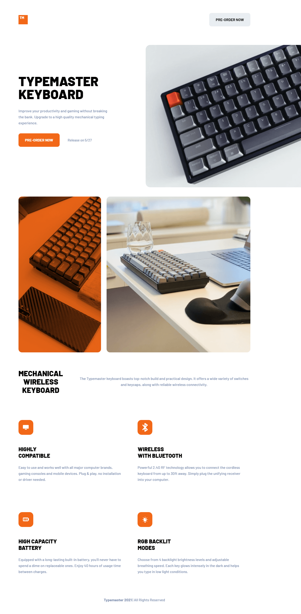

# Frontend Mentor - Typemaster pre-launch landing page solution

This is a solution to the [Typemaster pre-launch landing page challenge on Frontend Mentor](). Frontend Mentor challenges help you improve your coding skills by building realistic projects.

## Table of contents

-   [Frontend Mentor - Typemaster pre-launch landing page solution](#frontend-mentor---typemaster-pre-launch-landing-page-solution)
    -   [Table of contents](#table-of-contents)
    -   [Overview](#overview)
        -   [The challenge](#the-challenge)
        -   [Screenshot](#screenshot)
        -   [Links](#links)
    -   [My process](#my-process)
        -   [Built with](#built-with)
        -   [What I learned](#what-i-learned)
        -   [Continued development](#continued-development)
        -   [Useful resources](#useful-resources)
    -   [Author](#author)

## The challenge

Your challenge is to build out this landing page and get it looking as close to the design as possible.

You can use any tools you like to help you complete the challenge. So if you've got something you'd like to practice, feel free to give it a go.

Your users should be able to:

-   View the optimal layout depending on their device's screen size
-   See hover states for interactive elements

Want some support on the challenge? [Join our Slack community](https://www.frontendmentor.io/slack) and ask questions in the **#help** channel.

### Screenshot

### Links

-   Solution URL: [https://www.frontendmentor.io/solutions/html-css-css-variables-and-flexbox-and-grid-HkbfYiqBc]
-   Live Site URL: [https://darling-kangaroo-db3f67.netlify.app/]

## My process

### Built with

-   Semantic HTML5 markup
-   CSS custom properties
-   Flexbox
-   CSS Grid
-   Mobile-first workflow

**Note: These are just examples. Delete this note and replace the list above with your own choices**

### What I learned

This is a site that would have been difficult to complete a few months ago. I used this to practice on in the past and decided to complete it. I didn't take more than a few hours to complete. It would have taken a lot longer in the past.

### Continued development

I need more practice with CSS Grid, and this was a good project to work on.

### Useful resources

-   [https://gridbyexample.com/] - This was a big help with all the examples provided.

## Author

-   Website - [David Turner](https://github.com/brodiewebdt)
-   Frontend Mentor - [@brodiewebdt](https://www.frontendmentor.io/profile/brodiewebdt)
-   Twitter - [@brodiewebdt](https://www.twitter.com/brodiewebdt)
